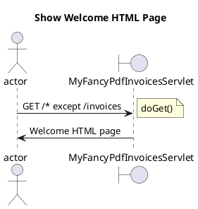
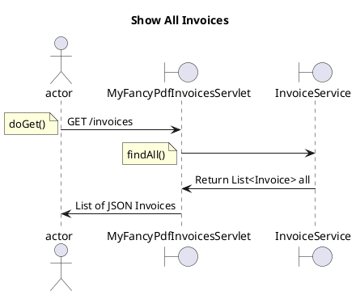
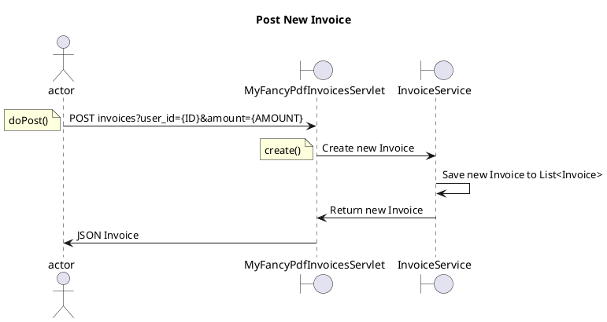

# My Fancy PDF Invoices

Follow-along code from Marco Behler's [The Confident Spring Professional](https://www.marcobehler.com/courses/spring-professional)
course covering Spring and Spring Boot.

This small web application is built up in three separate stages:

- Create a plain web application with modern Java and HttpServlets
    - Write simple Java web app with embedded Tomcat and Servlet API
    - Use shading to include dependencies in .jar file
    - Write HTML and JSON via Servlet API, using Jackson to configure behaviour with annotations
    - Handle dependencies with Application class pattern, including Constructor Injection (UserService object injected 
      into Invoice service object's constructor)
- Add Spring framework to the Java application
- Add Spring Boot to the Spring framework application

## Sequence Diagrams

